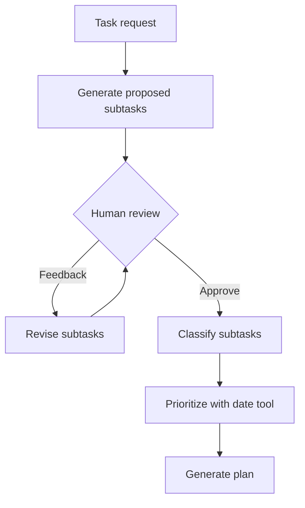

# AI Task Planner and Agent Workflows

An AI engineering training project that progresses from fixed LangChain pipelines to **LangGraph planning, tool use, retrieval and human review**. Flask interfaces expose the planner and document question-answering demos.

The repository preserves two independent implementations with separate dependency environments.

## Capabilities

| Area | Implementation |
| --- | --- |
| Text processing | Summarize, classify and count words |
| File tools | Summarization and word counting through tool-backed agents |
| Task planning | Generate subtasks, classify them, determine priority and produce a plan |
| Human review | Approve a proposed plan or request a revision before continuing |
| Tool selection | Calculator, current date/time, weather, Wikipedia and Tavily search |
| Conversation memory | Session history and JSON-backed persistence |
| Document QA | Retrieve context from an in-memory vector store and answer from that context |
| Interfaces | Planner UI and a separate PDF/DOCX/TXT upload UI |

## Planner workflow



The planning graph follows a fixed sequence after approval. Its prioritization stage uses an agent with a date tool; the other core stages use fixed-order chains. The tool-calling, memory and RAG demonstrations also have their own entry points.

## Two environments

- **`day1_chains/`:** the original LangChain `LLMChain` exercise.
- **`day2_agents_langgraph/`:** LCEL chains, LangGraph and tool-backed agents.

Install each folder's own `requirements.txt` into a separate environment. Combining them can introduce incompatible LangChain dependencies.

## Run the planner

PowerShell, from the repository root:

```powershell
cd day2_agents_langgraph
python -m venv .venv
.\.venv\Scripts\python.exe -m pip install -r requirements.txt
```

Create `day2_agents_langgraph/src/.env` with:

```dotenv
OPENAI_API_KEY=your_key_here
# Optional: only needed for the corresponding tools
OPENWEATHER_API_KEY=your_weather_key
TAVILY_API_KEY=your_search_key
```

Then run from `day2_agents_langgraph/src/`:

```powershell
cd src
..\.venv\Scripts\python.exe app.py
```

Open `http://127.0.0.1:5000`. Enter a task, review its proposed subtasks, then approve or provide feedback.

### Additional demonstrations

Run these commands from the same `src/` directory:

```powershell
..\.venv\Scripts\python.exe -m tools_agent.demo
..\.venv\Scripts\python.exe -m memory.session1
..\.venv\Scripts\python.exe -m memory.session2
..\.venv\Scripts\python.exe -m rag.demo
```

The two memory demonstrations run as separate processes to exercise persistence between sessions.

For the document upload interface:

```powershell
..\.venv\Scripts\python.exe -m rag.app
```

Open `http://127.0.0.1:5001`. The demo accepts PDF, DOCX and TXT documents. RAG uses a retrieve-and-insert-context chain with `InMemoryVectorStore`; the answer prompt asks the model to use retrieved content.

## Run the original chain exercise

In a separate terminal, starting from the repository root:

```powershell
cd day1_chains
python -m venv .venv
.\.venv\Scripts\python.exe -m pip install -r requirements.txt
$env:OPENAI_API_KEY = "your_key_here"
cd src
..\.venv\Scripts\python.exe main.py
```

The executable is under `src/`, rather than the day-one folder itself.

## Repository map

| Path | Responsibility |
| --- | --- |
| `day1_chains/src/chains/` | Original summarization and classification chains |
| `day2_agents_langgraph/src/graph/` | Planner state, nodes and feedback revision |
| `day2_agents_langgraph/src/agents/` | File-processing agents |
| `day2_agents_langgraph/src/tools_agent/` | Tool-calling demonstration |
| `day2_agents_langgraph/src/memory/` | Conversation persistence |
| `day2_agents_langgraph/src/rag/` | Retrieval and document QA |
| `day2_agents_langgraph/src/app.py` | Planner Flask application |

## Scope

This is a development demonstration with local persistence and development servers. It includes no authentication, HTTPS deployment or rate limiting. LLM requests and configured external tools transmit task or document context to their respective providers. An evaluation suite and deployment controls are future extensions.

## Licenses

Each exercise includes its own license: [day-one license](day1_chains/LICENSE) and [day-two license](day2_agents_langgraph/LICENSE).
